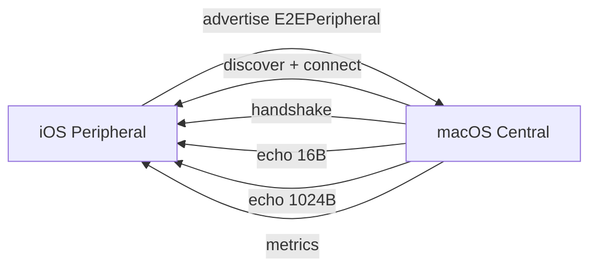
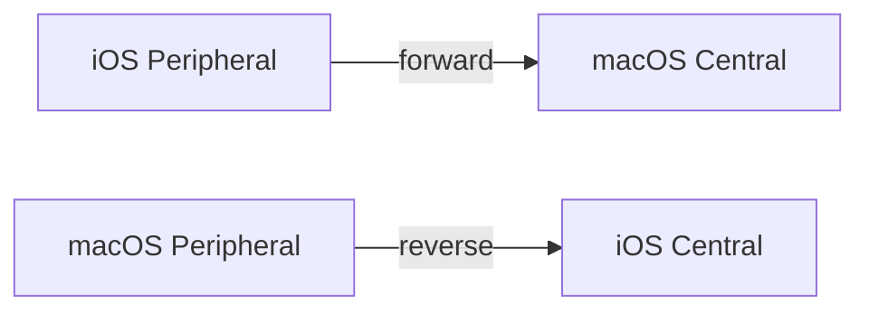

# Bleu E2E App

`BleuE2E` is a small cross-platform SwiftUI app for testing real BLE communication between two devices.

## Roles

| Device | Role | Action |
|---|---|---|
| iPhone or iPad | Peripheral | Start advertising |
| Mac | Central | Scan, select peer, run E2E |

## Test Flow



## Build

Open `Examples/E2E/BleuE2E.xcodeproj` in Xcode.

For iOS device runs, set the signing team for bundle identifier `com.1amageek.bleu.e2e`.

Command-line macOS build:

```bash
xcodebuild \
  -project Examples/E2E/BleuE2E.xcodeproj \
  -scheme BleuE2E \
  -destination 'platform=macOS' \
  CODE_SIGNING_ALLOWED=NO \
  build
```

Command-line iOS compile checks:

```bash
xcodebuild \
  -project Examples/E2E/BleuE2E.xcodeproj \
  -scheme BleuE2E \
  -destination 'generic/platform=iOS Simulator' \
  CODE_SIGNING_ALLOWED=NO \
  build

xcodebuild \
  -project Examples/E2E/BleuE2E.xcodeproj \
  -scheme BleuE2E \
  -destination 'generic/platform=iOS' \
  CODE_SIGNING_ALLOWED=NO \
  build
```

## One-Command Reliability E2E

The E2E runner builds both apps, installs the iOS app, and runs both directions:



Each direction runs a 10-iteration soak over one connection, then a dedicated reconnect pass. The payload set includes sizes around common BLE MTU boundaries.

```bash
Examples/E2E/run-e2e.sh
```

Use an explicit device when multiple physical iOS devices are attached:

```bash
Examples/E2E/run-e2e.sh --device 00008120-000434680C10C01E
```

Run a shorter smoke pass:

```bash
Examples/E2E/run-e2e.sh \
  --device 00008120-000434680C10C01E \
  --iterations 1 \
  --payload-sizes 16,1024 \
  --no-reconnect
```

Run one direction only:

```bash
Examples/E2E/run-e2e.sh --direction forward
Examples/E2E/run-e2e.sh --direction reverse
```

Manual interaction is limited to OS-controlled gates:

| Gate | Why it cannot be automated | Required action |
|---|---|---|
| iOS device lock | SpringBoard rejects app launch on a locked device | Unlock the device and keep it awake before running |
| Bluetooth permission | TCC requires user consent | Allow Bluetooth on first app launch |
| macOS Bluetooth permission | TCC requires user consent | Allow Bluetooth if macOS prompts |

After those gates are satisfied, the runner is unattended.

The default reliability suite covers:

| Coverage | Default |
|---|---|
| Direction | forward and reverse |
| Repetition | 10 iterations |
| Reconnect | two dedicated peer-restart reconnect passes |
| Reconnect payload | 16 bytes |
| Payload sizes | 16, 182, 183, 244, 512, 1024 bytes |
| Peer requirement | at least 1 peer |
| Scan retry | 2 attempts, 8 seconds each |
| Result files | forward, reverse, and reconnect JSON files under `.build/` |

Set `--minimum-peer-count 2` or higher when multiple physical peer devices are available.

## Manual Run

Manual operation is still useful while debugging UI state:

1. Launch the app on iOS and keep the role set to `Peripheral`.
2. Tap `Advertise`.
3. Launch the app on macOS and keep the role set to `Central`.
4. Tap `Scan`.
5. Select the discovered peer.
6. Tap `Run`.

The run passes when `Handshake`, `Echo 16B`, `Echo 1024B`, and `Remote metrics` all pass.

## Automation

The app accepts launch arguments for unattended runs:

| Argument | Effect |
|---|---|
| `--role peripheral` | Select peripheral mode |
| `--start-peripheral` | Start advertising after launch |
| `--role central` | Select central mode |
| `--run-central` | Scan and run the E2E checks |
| `--result-path <path>` | Write a JSON result summary |
| `--ready-timeout <seconds>` | Wait for CoreBluetooth readiness before advertising or scanning |
| `--scan-timeout <seconds>` | Scan duration for each discovery pass |
| `--scan-attempts <count>` | Retry discovery when the minimum peer count is not met |
| `--iterations <count>` | Number of central test iterations |
| `--payload-sizes <csv>` | Payload byte sizes for each iteration |
| `--reconnect-cycles <count>` | Number of iterations in the dedicated reconnect pass |
| `--reconnect-between-iterations` | Disconnect and rediscover between every main soak iteration |
| `--minimum-peer-count <count>` | Fail unless at least this many peers are found |
| `--exit-after-run` | Exit after central automation finishes |
